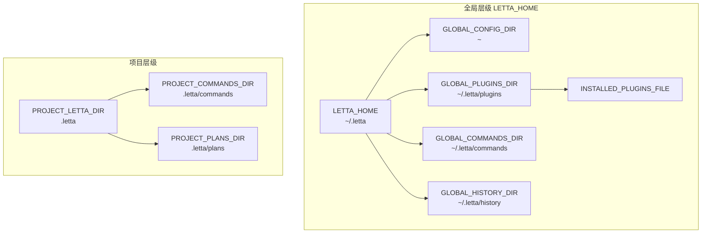

# 核心概念

## 概述

`jcode-conf-py` 是一个轻量级配置路径常量库，从 `jcode` 项目中提取出来，专门用于定义 Letta 系统的标准路径约定。该库通过导出标准化的路径常量，确保不同组件间路径引用的一致性。

## 概述

本库做什么：
- 集中管理 Letta 相关路径常量
- 支持环境变量覆盖（`LETTA_HOME`）
- 区分全局路径与项目级路径
- 提供类型安全的 `Path` 对象

## 关键术语

| 术语 | 定义 | 示例 |
|------|------|------|
| `LETTA_HOME` | Letta 全局配置根目录 | `~/.letta` 或 `$LETTA_HOME` |
| `GLOBAL_*` | 全局路径常量（位于 `LETTA_HOME` 下） | `GLOBAL_COMMANDS_DIR` |
| `PROJECT_*` | 项目级路径常量（相对于项目根目录） | `PROJECT_LETTA_DIR = .letta` |
| `INSTALLED_PLUGINS_FILE` | 已安装插件清单文件路径 | `~/.letta/plugins/installed_plugins.json` |

## 概念模型

说明：
- `LETTA_HOME` 是全局配置的根节点，可通过环境变量覆盖
- 全局路径全部以 `LETTA_HOME` 为基准
- 项目级路径始终相对于项目根目录（`.letta`）

## 设计哲学

1. **单一数据源**：路径常量集中定义，避免硬编码路径散落在代码库中
2. **环境可配置**：`LETTA_HOME` 支持环境变量覆盖，适配不同部署场景
3. **明确语义**：前缀 `GLOBAL_` vs `PROJECT_` 清晰区分作用域
4. **不可变常量**：导出的路径常量应为事实上的常量，不应在运行时修改
