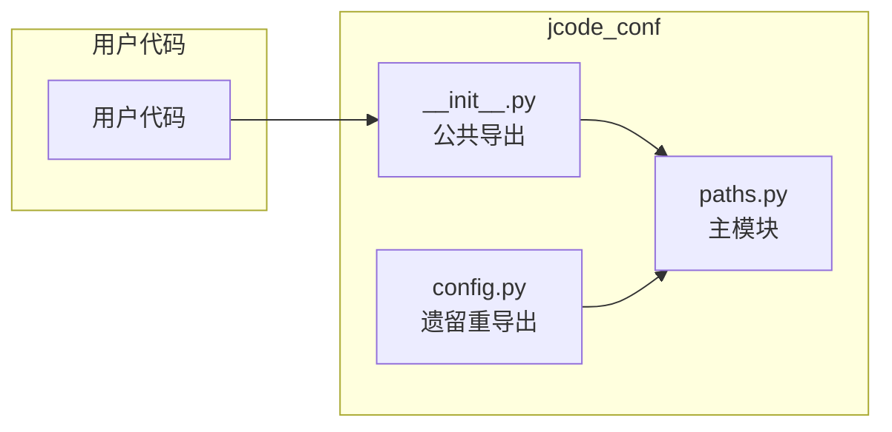

# 核心架构

## 概述

`jcode-conf-py` 采用极简架构：单个 Python 包 `jcode_conf`，内含两个模块 `paths.py`（主路径常量定义）和 `config.py`（遗留重导出）。所有路径常量基于 `pathlib.Path` 构建，确保跨平台兼容。

## 系统概览



说明：用户代码仅需导入 `jcode_conf` 包，模块内部自动加载路径常量定义。

## 组件层级

### 层级 1：公共导出层
- `src/jcode_conf/__init__.py:1-5`
- 重新导出 `paths.py` 中的常量，定义公共 API 表面

### 层级 2：路径定义层
- `src/jcode_conf/paths.py:1-29`
- 定义所有路径常量及其计算逻辑

### 层级 3：依赖层
- Python 标准库：`pathlib.Path`、`os.environ`

## 关键模式

### 路径构建模式

```python
# 全局路径：基于 LETTA_HOME 计算
GLOBAL_PLUGINS_DIR = LETTA_HOME / "plugins"

# 项目路径：相对路径
PROJECT_LETTA_DIR = Path(".letta")
```

### 环境变量解析模式

```python
LETTA_HOME = Path(os.environ.get("LETTA_HOME", Path.home() / ".letta")).expanduser().resolve()
```

关键点：
1. 优先读取 `$LETTA_HOME` 环境变量
2. 默认值：`~/.letta`
3. `expanduser()` 解析 `~` 为用户主目录
4. `resolve()` 将相对路径转为绝对路径（仅对 `LETTA_HOME`）

## 数据流

无运行时数据流——这是一个纯静态常量库，不涉及 I/O 或状态变更。

## 扩展点

### 如何添加新路径常量

1. 在 `src/jcode_conf/paths.py` 中定义新常量
2. 在 `__all__` 列表中注册
3. 在 `src/jcode_conf/__init__.py` 中重新导出（如需公共访问）
4. 在 `tests/test_paths.py` 中添加测试

### 示例：添加新路径

```python
# src/jcode_conf/paths.py
GLOBAL_CACHE_DIR = LETTA_HOME / "cache"  # 新增

# __all__ 列表中添加 "GLOBAL_CACHE_DIR"
```
