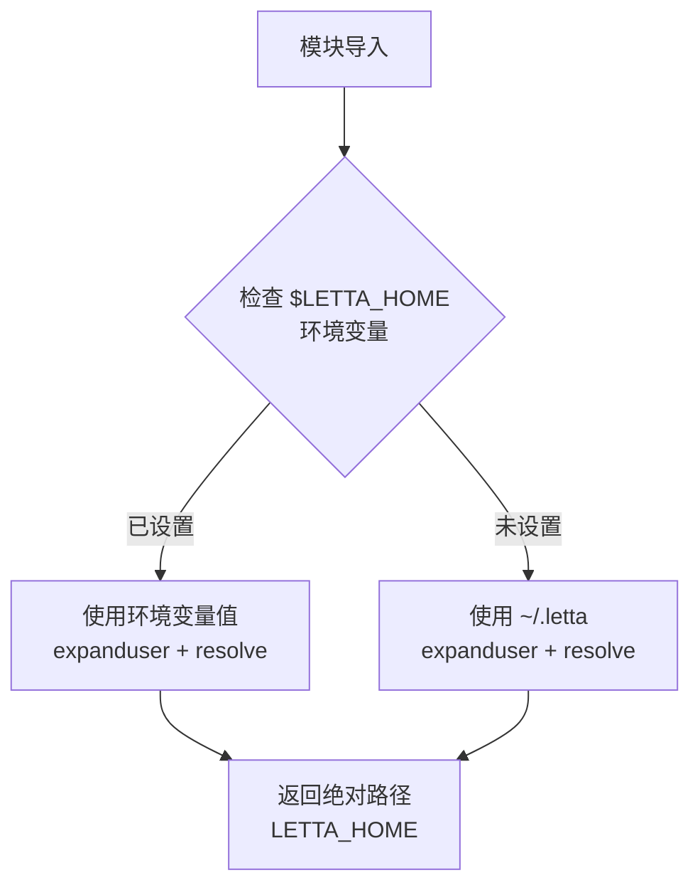

# 环境变量覆盖机制

## 概述

`LETTA_HOME` 路径常量支持通过 `LETTA_HOME` 环境变量进行覆盖，默认值为 `~/.letta`。

## 概览

环境变量覆盖机制允许用户在不修改代码的情况下，自定义 Letta 全局配置目录的位置。这对于以下场景至关重要：
- 多租户/多实例部署
- 测试环境隔离
- 临时使用不同配置

## 设计意图

### 解决的问题

- 开发/测试时需要使用非默认配置目录
- 容器化部署中需要指定配置挂载点
- 用户主目录空间不足，需要将配置存放在其他分区

### 设计决策

- **默认值基于 `Path.home()`**：确保未设置环境变量时仍有合理默认值
- **单一配置根**：`LETTA_HOME` 作为唯一配置根，简化配置层级
- **惰性计算**：环境变量在模块导入时读取，而非运行时

## 架构



## 契约（Contract）

| 字段 | 值 |
|------|-----|
| 环境变量名 | `LETTA_HOME` |
| 默认值 | `~/.letta` |
| 解析规则 | `expanduser()` → `resolve()` |
| 结果类型 | `pathlib.Path` (绝对路径) |
| 幂等性 | 是（多次导入结果相同） |

## API 参考

```python
# src/jcode_conf/paths.py:6
LETTA_HOME = Path(os.environ.get("LETTA_HOME", Path.home() / ".letta")).expanduser().resolve()
```

### Algorithm 伪代码

```
FUNCTION get_letta_home():
    env_value = os.environ.get("LETTA_HOME")

    IF env_value IS NOT NULL:
        base_path = env_value
    ELSE:
        base_path = Path.home() / ".letta"

    RETURN Path(base_path).expanduser().resolve()
```

## 集成矩阵

| 外部依赖 | 接口语义 | 失败策略 |
|----------|----------|----------|
| `os.environ` | 读取 `LETTA_HOME` | 未设置时 fallback 到 `~/.letta` |
| `pathlib.Path` | 路径对象构造 | N/A |

## 使用示例

### 示例 1：设置自定义 Letta 目录

```bash
# 在 shell 中设置
export LETTA_HOME=/opt/letta/config

# Python 代码
python -c "from jcode_conf import LETTA_HOME; print(LETTA_HOME)"
# 输出：/opt/letta/config
```

### 示例 2：在 Python 中临时覆盖

```python
import os
from jcode_conf import LETTA_HOME

# 临时覆盖（仅影响当前进程）
os.environ["LETTA_HOME"] = "/tmp/test_letta"

# 注意：必须在导入 jcode_conf 之前设置环境变量
# 因为常量在导入时就已经固定
```

说明：环境变量必须在 `import jcode_conf` **之前**设置，否则导入的常量不会反映新值。

### 示例 3：验证绝对路径解析

```python
from jcode_conf import LETTA_HOME

assert LETTA_HOME.is_absolute(), "LETTA_HOME must be absolute"
# 测试用例：src/jcode_conf/tests/test_paths.py:14-15
```

## 高级主题

### `expanduser()` vs `resolve()`

| 方法 | 作用 | 示例 |
|------|------|------|
| `expanduser()` | 解析 `~` 为用户主目录 | `~/.letta` → `/home/user/.letta` |
| `resolve()` | 解析相对路径为绝对路径 | `.letta` → `/current/dir/.letta` |

### 边界情况

| 场景 | 行为 |
|------|------|
| `$LETTA_HOME` 设置为 `~` | `expanduser()` 解析为实际主目录 |
| `$LETTA_HOME` 设置为相对路径 | `resolve()` 转为绝对路径 |
| `$LETTA_HOME` 设置为不存在的目录 | 不会报错，路径照常生成 |

## 限制与权衡

- **惰性限制**：环境变量必须在导入前设置，导入后修改无效
- **无验证**：不检查设置值是否为有效目录
- **全局状态**：依赖进程级环境变量，可能产生进程间干扰

## 相关特性

- [路径常量系统](./04-feature-path-constants.md) - 基于 `LETTA_HOME` 的路径常量定义
